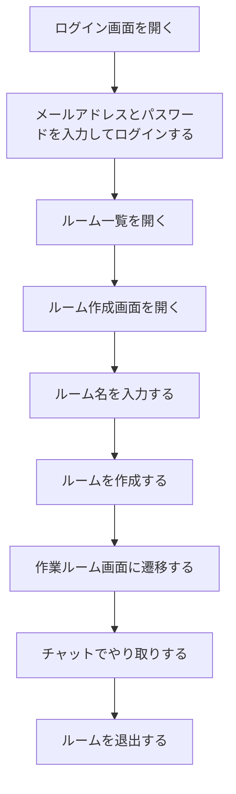

# オンライン作業スペースアプリ MVP要件定義書

## 1. 概要

本アプリは、ユーザーがオンライン上に作業ルームを作成し、他のユーザーと同じルームに参加してチャットでやり取りしながら作業できるWebアプリケーションである。

---

## 2. 技術スタック

### 2.1 フロントエンド

- React
- 任意のCSSフレームワークを使用可能

### 2.2 バックエンド

- Spring Boot
    - spring security
    - Mapper
- PostgreSQL

---

## 3. 必須要件

本アプリは、以下の要件を満たす必要がある。

- Google Chrome の最新安定バージョンと互換性があること
- ブラウザのコンソールに警告やエラーメッセージが表示されないこと
- プライバシーポリシーを作成すること
- 利用規約を作成すること
- 任意のCSSフレームワークを使用できること
- README を必ず記述すること

---

## 4. MVP仕様

## 4.1 MVPの方針

MVPでは、オンライン作業スペースとして最低限成立する機能に絞る。

MVPのゴールは以下とする。

> ユーザーが作業ルームを作成し、他のユーザーがそのルームに参加し、ルーム内チャットでやり取りできる状態にする。

---

## 4.2 MVPで実装する機能

| 分類 | 機能 | 内容 |
|---|---|---|
| ルーム | ルーム作成 | ユーザーが作業ルームを作成できる |
| ルーム | ルーム一覧 | 作成された公開ルームを一覧表示できる |
| ルーム | ルーム参加 | ユーザーが任意の公開ルームに参加できる |
| ルーム | ルーム退出 | 参加中のルームから退出できる |
| チャット | メッセージ送信 | ルーム内でチャットメッセージを送信できる |
| チャット | メッセージ表示 | ルーム内のメッセージを表示できる |
| リアルタイム | WebSocket | チャットや入退室をリアルタイムに反映する |
| 通知 | 画面内通知 | 他のユーザーが参加・退出の結果を画面上に表示する |

---

## 4.3 MVPでは実装しない機能

MVPでは以下の機能は実装対象外（MVPでの扱い不要）とする。

- フレンド機能
    - お気に入り登録
    - フレンド解除
- 複数人音声通話
- 作業履歴
    - ルーム利用ユーザーの作業時間
- 作業タイマー
- 退会機能
- ブラウザPush通知
    - 「フレンドがルームを作成しました。」のようなメッセージを想定
- 通報・ブロック
- Prometheus / Grafana
- Googleログイン(要検討)
- 二段階認証(要検討)

---

## 4.4 MVPにおけるルーム仕様

MVPでは、すべての作業ルームを公開ルームとして扱う。

### ルーム公開範囲

| 公開範囲 | MVP対応 | 説明 |
|---|---|---|
| 公開ルーム | 対応 | ログイン済み、または参加名を入力したユーザーが誰でも参加できる |

---

## 4.5 MVPのユーザー識別

MVPでは、実装コストを抑えるため、以下の方式を採用する。

### 簡易認証方式

- ユーザー登録・ログインを実装する
- ログイン済みユーザーのみルーム作成・参加できる

---

## 5. MVP機能要件

## 5.1 ルーム作成機能

### 概要

ユーザーが作業ルームを作成できる。

### 要件

- ユーザーはルーム名を入力してルームを作成できる
- 作成されたルームは公開ルームとして扱う
- 作成されたルームはルーム一覧に表示される
- ルーム作成後、作成者はそのルームに参加できる
- ルーム作成に成功した場合、画面上に通知を表示する
- ルーム作成に失敗した場合、エラーメッセージを表示する
- 人数上限が設定できること

### 入力項目

| 項目 | 必須 | 備考 |
|---|---:|---|
| ルーム名 | 必須 | 作業内容が分かる名前 |

---

## 5.2 ルーム一覧機能

### 概要

現在参加可能な作業ルームを一覧表示する。

### 要件

- 作成済みの公開ルームを一覧表示できる
- ルーム名を表示する
- 現在の参加人数を表示する
- ルーム作成日時を表示する
- ユーザーは一覧からルームを選択して参加できる

### 表示項目

| 項目 | 内容 |
|---|---|
| ルーム名 | 作業ルームの名前 |
| 参加人数 | 現在の参加人数 |
| 作成日時 | ルームが作成された日時 |
| 入室ボタン | ルームに参加するためのボタン |

---

## 5.3 ルーム参加機能

### 概要

ユーザーが公開ルームに参加できる。

### 要件

- ユーザーはルーム一覧から任意のルームに参加できる
- 参加時に表示名を設定できる
    - 参加後に表示名が変更できる
- 参加後、作業ルーム画面に遷移する
- 参加者一覧に自分が表示される
- 他の参加者にも入室がリアルタイムに反映される
- ルーム参加に成功した場合、画面上に通知を表示する
- ルーム参加に失敗した場合、エラーメッセージを表示する

---

## 5.4 ルーム退出機能

### 概要

ユーザーが参加中の作業ルームから退出できる。

### 要件

- ユーザーは退出ボタンからルームを退出できる
- 退出後、ルーム一覧画面に戻る
- 他の参加者にも退出がリアルタイムに反映される
- 退出に成功した場合、画面上に通知を表示する

---

## 5.5 チャット機能

### 概要

同じ作業ルームに参加しているユーザー同士が、テキストチャットでやり取りできる。

### 要件

- ルーム内でメッセージを送信できる
- 送信したメッセージは同じルームの参加者にリアルタイム表示される
- メッセージには送信者名を表示する
- メッセージには送信時刻を表示する
- 空文字のメッセージは送信できない
- 100 文字以上は送信できない
- メッセージ送信に失敗した場合、エラーメッセージを表示する

### 表示項目

| 項目 | 内容 |
|---|---|
| 送信者名 | メッセージを送信したユーザー |
| 本文 | メッセージ内容 |
| 送信時刻 | メッセージ送信日時 |

---

## 5.6 リアルタイム更新機能

### 概要

WebSocketを使用して、ルーム内の状態をリアルタイムに反映する。

### 対象イベント

| イベント | 内容 |
|---|---|
| room:user_joined | ユーザーがルームに参加した |
| room:user_left | ユーザーがルームから退出した |
| chat:message | チャットメッセージが送信された |
| room:updated | ルーム情報が更新された |

---

## 5.7 画面内通知機能

### 概要

ユーザー操作の結果を画面上に通知する。

### 要件

- ルーム作成時に成功・失敗メッセージを表示する
- ルーム参加時に成功・失敗メッセージを表示する
- ルーム退出時に成功・失敗メッセージを表示する
- チャット送信失敗時にエラーメッセージを表示する
- 通知はToastまたはフラッシュメッセージで表示する

---

## 6. MVP画面要件

## 6.1 画面一覧

| 画面 | 内容 |
|---|---|
| ホーム画面 | アプリ概要、公開ルーム一覧、ルーム作成への導線 |
| ログイン画面 | メールアドレスとパスワードでログイン |
| ユーザー登録画面 | 新規ユーザーアカウントを作成 |
| ルーム作成画面 | 新しい作業ルームを作成 |
| 作業ルーム画面 | 参加者一覧、チャットを表示 |

---

## 6.2 ホーム画面

### 要件

- アプリ名を表示する
- アプリ概要を表示する
- 公開ルーム一覧を表示する
- 各ルームの参加人数を表示する
- 各ルームの参加ボタンを表示する
- ルーム作成画面へのリンクを表示する
- 未ログイン時はログイン画面へ遷移する

---

## 6.3 ログイン画面

### 要件

- メールアドレス入力欄を表示する
- パスワード入力欄を表示する
- ログインボタンを表示する
- ユーザー登録画面へのリンクを表示する
- ログイン成功時、ホーム画面へ遷移する

---

## 6.4 ユーザー登録画面

### 要件

- ユーザー名入力欄を表示する
- メールアドレス入力欄を表示する
- パスワード入力欄を表示する
- ユーザー登録ボタンを表示する
- 登録成功時、ログイン画面へ遷移する

---

## 6.5 ルーム作成画面

### 要件

- ルーム名入力欄を表示する
- 作成ボタンを表示する
- 作成成功時、作業ルーム画面へ遷移する

---

## 6.6 作業ルーム画面

### 要件

- ルーム名を表示する
- 参加者一覧を表示する
- チャットメッセージ一覧を表示する
- メッセージ入力欄を表示する
- メッセージ送信ボタンを表示する
- 退出ボタンを表示する

---

## 7. MVPユーザーフロー

## 7.1 ルームを作成して作業を始める流れ

